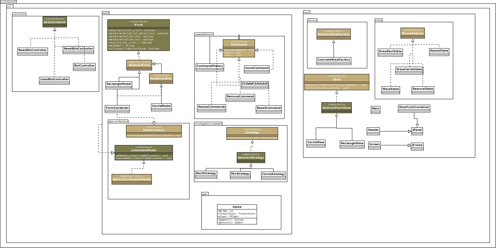

# Jeu De Formes

## Description

Jeu De Formes est un projet Java conçu pour illustrer l'utilisation de divers patterns de conception, notamment 

- Le pattern MVC
- Le pattern Commande pour les actions de dessin 
- Le pattern Observateur pour la mise à jour des vues 
- Le pattern Stratégie pour le positionnement des formes.
- Le pattern State
- Méthode factory

## Utilisation

L'application démarre avec une interface graphique où vous pouvez choisir entre ajouter des formes, les déplacer, les supprimer ou modifier leurs tailles. 

Utilisez les boutons fournis dans l'interface pour interagir avec les formes.

### Structure du Projet

Le projet est organisé comme suit :


```plaintext
.
├── build  Répertoire de build contenant les fichiers .class compilés.
├── dist   Contient les archives exécutables du projet, y compris le fichier .jar.
├── doc    Documentation générée automatiquement pour le projet.
├── lib    Bibliothèques tierces nécessaires pour le projet.
├── src    Contient les sources du projet, y compris les contrôleurs, modèles et vues.
├── test   Contient les tests unitaires pour le projet.
```
### Démarrage rapide

Pour lancer l'application, suivez ces instruction

### Prérequis

- Java JDK 11 ou supérieur
- Apache Ant (pour la construction du projet si `build.xml` est utilisé)

### Installation

1. Clonez le dépôt sur votre machine locale :

```bash
git clone git@github.com:Ahmat-2000/projetAnnuel.git
```

2. Naviguez dans le dossier du projet :

```bash
cd JeuDeFormes
```

3. Compilez le projet (si vous utilisez Apache Ant) :

```bash
# Si vous avez fait des modifications, il suffit de lancer la commande ant
ant 
```

4. Exécutez le fichier JAR :

```bash
java -jar dist/JeuDeFormes-1.0.jar
```

## Diagrame



## Contribuer

Les contributions à ce projet sont les bienvenues.

## Licence

Ce projet est en open source

## Contact

Pour toute question ou suggestion, n'hésitez pas à contacter Ahmat à ahmatmhtlouky@gmail.com.

## Remerciements

- Merci à tous ceux qui contribuent à enrichir ce projet.
